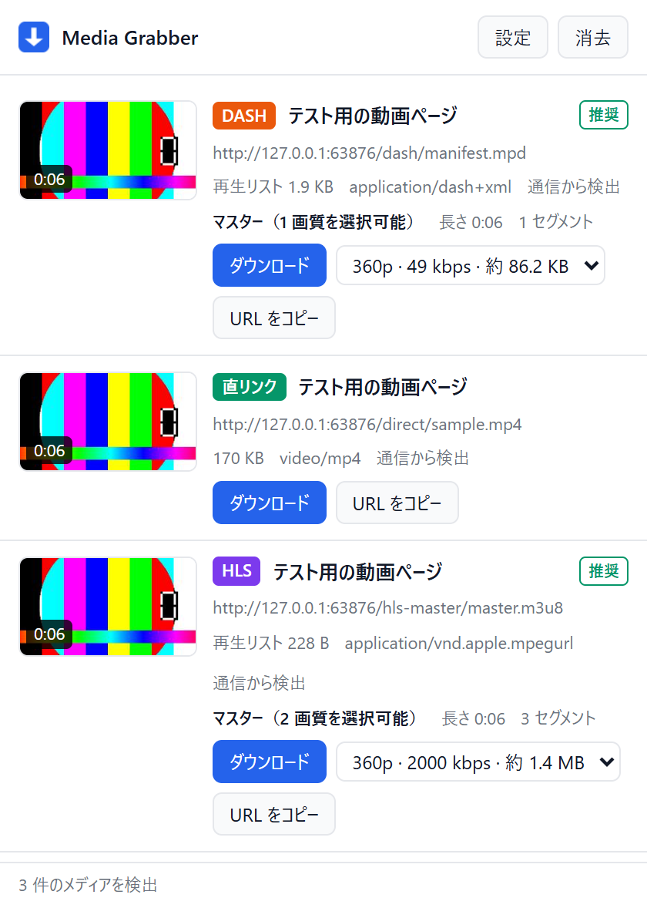

# Media Grabber

ページ上の動画を検出して端末に保存する Chrome 拡張機能（Manifest V3）。
Video DownloadHelper と同種の機能を自前実装したもので、**回数制限・時間制限・有料版の制約は一切ありません**。



## できること

| 種別 | 内容 | 保存形式 |
| --- | --- | --- |
| 直リンク | `.mp4` / `.webm` / `.mkv` / `.mov` / 音声ファイルなど | 元の形式のまま |
| HLS | `.m3u8`（マスター/メディア両対応、画質選択可） | `.ts` または `.mp4` |
| DASH | `.mpd`（SegmentTemplate / SegmentTimeline / SegmentList） | `.mp4` |

- ページを開いて動画を再生すると、ツールバーのアイコンに検出件数が出ます
- 一覧には**サムネイルと再生時間**が付くため、複数の動画がある場合も区別できます
- ポップアップから画質を選んでダウンロードできます
- ストリームは全セグメントを取得して 1 本のファイルに連結します
- 直リンクは Chrome 標準のダウンローダに渡すため、サイズ制限なく保存できます

### 一覧に表示される情報の読み方

| 表示 | 意味 |
| --- | --- |
| サムネイル | 再生中の映像から取り出したコマ。取得できない場合は `poster` 属性、OGP 画像の順に代替 |
| 再生時間バッジ | ページ上の `<video>` の長さ。「画質を調べる」後はマニフェストから求めた正確な値 |
| `170 KB`（直リンク） | 動画ファイルそのもののサイズ |
| `再生リスト 228 B`（HLS/DASH） | **動画ではなく、再生リスト（.m3u8 / .mpd）のテキストのサイズ**。動画の推定サイズは「画質を調べる」を押すと画質ごとに表示されます |

同じ動画に対して HLS の項目が 2 つ出ることがあります。片方は画質一覧が書かれた
**マスタープレイリスト**（数百バイト）、もう片方はセグメントが列挙された
**メディアプレイリスト**（長い動画では 100 KB 超）です。どちらからでも保存でき、
マスターを選ぶと画質を選択できます。「画質を調べる」を押すとどちらなのか表示されます。

### 対応しないもの

- **DRM 保護コンテンツ**（Netflix / Amazon Prime / Disney+ など Widevine 系）
  技術的保護手段の回避に当たるため、意図的に実装していません。DASH の `ContentProtection` を検出した時点で中止します。
- **暗号化された HLS**（`#EXT-X-KEY` が `AES-128` 等）も同様に中止します。
  該当する配信は一覧に `暗号化（非対応）` と表示され、ダウンロードボタンが無効になります。
  TVer など、暗号化を適用している配信サービスはこれに該当します。
- ライブ配信は「その時点で配信されている範囲」のみ保存されます。

保存したファイルの利用は、各サイトの利用規約と著作権法の範囲内で行ってください。

## インストール

1. Chrome で `chrome://extensions` を開く
2. 右上の「**デベロッパー モード**」をオンにする
3. 「**パッケージ化されていない拡張機能を読み込む**」を押す
4. このリポジトリの `extension` フォルダを選ぶ

> コマンドラインの `--load-extension` は Chrome 137 以降で無効化されています。
> 上記の UI からの読み込みは従来どおり使えます。

## 使い方

1. 動画のあるページを開いて再生する（少しシークすると確実に検出されます）
2. ツールバーの Media Grabber アイコンをクリック
3. 一覧から目的の動画の「ダウンロード」を押す
   - HLS / DASH は「画質を調べる」を押すと解像度を選べます
4. 既定では `ダウンロード/MediaGrabber/` に保存されます（設定で変更可）

### 保存先について

保存先は「**Chrome のダウンロード フォルダー** + 設定した**サブフォルダ**」になります。
拡張機能から絶対パスを指定することは Chrome の仕様上できません
（`chrome.downloads.download` が `Invalid filename` で拒否します）。

`N:\Videos\MediaGrabber` に保存したい場合は、次のようにします。

1. Chrome の `chrome://settings/downloads` を開く
2. 「保存先」を `N:\Videos` に変更する
3. 拡張機能の設定でサブフォルダを `MediaGrabber` のままにする

保存が終わると、実際の保存先フォルダーがポップアップに表示されます。

### MP4 にする

動画と一緒に、ダブルクリックするだけで MP4 にできる `.bat` が保存されます。

| 保存されたもの | 一緒に保存される .bat | 動作 |
| --- | --- | --- |
| `〜.video.mp4` と `〜.audio.mp4` | `〜.結合.bat` | 映像と音声を結合して MP4 にする |
| `〜.ts` | `〜.変換.bat` | MP4 に変換する |

実行すると保存名を聞かれます。そのまま Enter を押せば既定の名前になり、入力すれば
その名前で保存されます（`.mp4` は自動で補われます）。同名のファイルがある場合は
上書きするか確認します。

`〜.結合.bat` では続けて音ズレ補正の秒数も聞かれます。補正が不要なら Enter を押してください。

| 症状 | 入力する値 |
| --- | --- |
| 音声が先に聞こえる | 正の値（例 `0.2`） |
| 音声が後から聞こえる | 負の値（例 `-0.15`） |

ズレ量は聞き取りで見当をつけ、合うまで値を変えて実行し直すのが確実です。

変換が終わると、続けて 2 つのことを確認します。どちらも **Enter で削除**、`n` を入力すると残します。

1. 元のファイル（`〜.video.mp4` / `〜.audio.mp4` / `〜.ts`）を削除するか
2. その `.bat` 自身を削除するか

既定のまま Enter を押していくと、MP4 が 1 本だけ残ります。削除は出力ファイルができたことを
確認してからのみ行うため、変換に失敗した場合は元のファイルがそのまま残ります。

コマンドラインからは `〜.結合.bat 出力名 補正値 元削除 自身削除` のように引数でも渡せます
（例: `〜.結合.bat 動画 0.2 y n`）。変換用は `〜.変換.bat 出力名 元削除 自身削除` です。

#### 保存後にファイル名を変えた場合

自動で付く名前がページのタイトル由来で長すぎたり不適切なことがあります。
名前を変更しても `.bat` はそのまま使えます。元ファイルを次の順に探すためです。

1. **保存時の名前** — 変更していなければこれで見つかります
2. **`.bat` 自身の名前** — 動画と `.bat` を同じ名前に変えれば見つかります
   （`動画.ts` と `動画.変換.bat`、`動画.video.ts` と `動画.結合.bat`）
3. **入力** — 上で見つからない場合は、名前の入力を求めます。貼り付けてください

出力の既定名も 2. の名前に追従します。

そもそも名前を手で付けたい場合は、設定の「**保存時に保存先を確認する**」を有効にしてください。
保存ダイアログで付けた名前を `.bat` が使うため、あとから変更する必要がなくなります。

いずれも `-c copy` で入れ物を作り直すだけなので、**再エンコードされず画質・音質は
劣化しません**。数秒で終わります。ffmpeg が PATH に無い場合はその旨を表示します。

`.bat` が不要であれば、設定の「MP4 にする .bat を一緒に保存する」を外してください。
手で実行する場合は次のとおりです。

```bash
ffmpeg -i "動画.video.mp4" -i "動画.audio.mp4" -c copy "動画.mp4"
ffmpeg -i "動画.ts" -c copy "動画.mp4"
```

なお映像と音声が分かれるのは、配信側が別トラックで配信しているためです。音声 1 本を
複数の画質で使い回せる、音声の切り替えに対応できる、といった理由による一般的な構成です。
`.ts` はそのままでも VLC などで再生できます。

## 構成

```
extension/
  manifest.json
  background.js          検出・状態管理・ダウンロード指示（Service Worker）
  content/scan.js        ページ内の <video>/<audio> から直リンクを補完検出
  offscreen/             セグメント取得と Blob 生成（SW では Blob を作れないため）
  popup/                 一覧 UI
  lib/
    util.js              種別判定・ファイル名生成・コンテナ判定
    m3u8.js              HLS プレイリスト解析
    mpd.js               DASH マニフェスト解析
    xml.js               依存なしの最小 XML パーサ
    downloader.js        ダウンロード中核（fetch を注入するため単体で実行可能）
    batch.js             MP4 化用のバッチファイル生成
    cp932.js             バッチファイルを CP932 で書き出すための符号化
test/                       検証用（配布には不要）
tools/make-icons.mjs        アイコン PNG の生成
tools/make-fixtures.mjs     テスト用の実動画・HLS・DASH の生成
tools/screenshot-popup.mjs  ポップアップの見た目を撮影
```

`lib/` は Chrome API に依存しないため、Node からそのまま実行してテストできます。

## テスト

```bash
npm test
```

- `npm run test:core` — ffmpeg で生成した実動画・HLS・DASH に対してダウンロード処理を実行し、
  出力を ffprobe で検証する（68 項目）
- `npm run test:bat` — 生成した .bat を実際に cmd.exe で実行し、MP4 が作られることを
  ffprobe で確認する（74 項目）
- `npm run test:ext` — manifest の整合性と、chrome API をスタブ化した background.js の
  動作を検証する（38 項目）
- `npm run test:e2e` — 実際の Chrome に拡張機能を読み込み、ポップアップ UI の
  ボタンを操作して保存されたファイルを ffprobe で検証する（43 項目）

事前に ffmpeg / ffprobe が必要です。テストフィクスチャの生成は次のコマンドで行います。

```bash
npm run fixtures
```

E2E は `--load-extension` が使える Chrome for Testing を利用します。未取得の場合は次で入手します。

```bash
npx @puppeteer/browsers install chrome@stable --path test/browser
```

## 既知の制約

- ストリームは一度メモリ上で結合してから保存するため、非常に長い動画（数 GB 規模）では
  メモリを圧迫します。長時間の配信は画質を落とすか分割して取得してください。
- `blob:` を使う MSE プレイヤーでは `<video>` の `src` からは取得できません。
  この場合はネットワーク側で捕捉したマニフェスト（HLS / DASH）を使ってください。
- セグメントが別ドメインにある場合、CDN が Referer を要求することがあります。
  拡張機能側でページのオリジンを Referer として付与しますが、追加の署名付き URL や
  トークンを要求するサイトでは取得できないことがあります。
